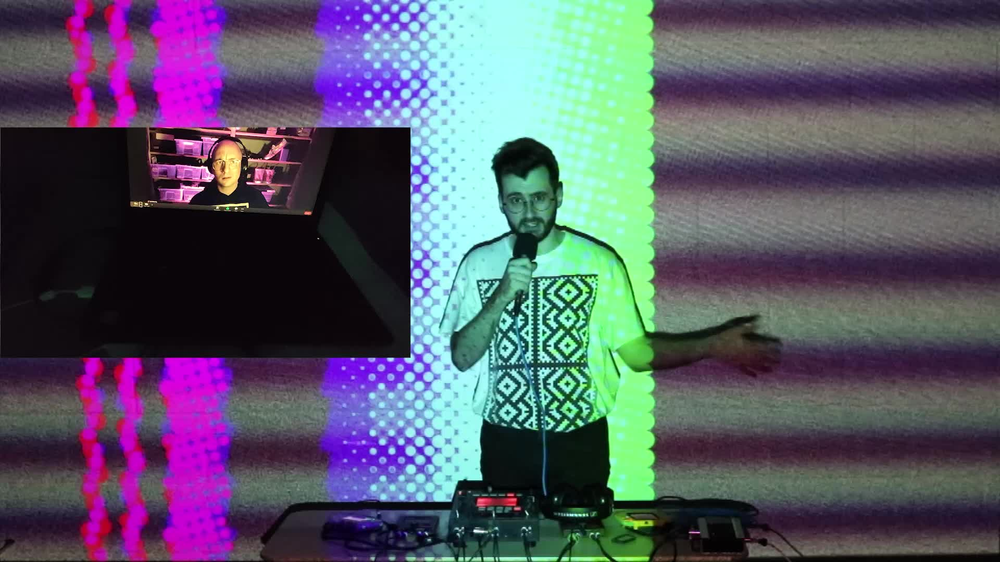

<h1>2xAA &  NERDDISCO @ DevFest Live 2021</h1>

---

- [General](#general)
- [Resources](#resources)
- [Thanks](#thanks)

---

## General

* Event: [DevFest Live 2021](https://devfest.live)
* Date: Sat, May 22, 1:00 PM (CEST)
* Venue: Online via [SpatialChat](https://spatial.chat)

## Resources

* [modV](https://modv.vcync.gl), an open-source software to create live visual experiences
* [Sam Wray](https://twitter.com/_2xAA) aka [2xAA](https://2xaa.fm), doing live music using 
  * 2 x Game Boy Advance running [nanoloop](https://www.nanoloop.com/two/index.html)
  * 2 x Korg mini-KP Kaoss Pad
  * 1 x Korg KM-2 Kaoss Mixer
* [Tim Pietrusky](https://twitter.com/TimPietrusky) aka [NERDDISCO](https://nerddis.co), doing live visuals using 
  * [modV](https://modv.vcync.gl)
  * 1 x Novation Launchpad Pro MK2

## Thanks

To the DevFest Live team, especially "Zsigmond P. Toth", for giving us the opportunity to take part at this event. 